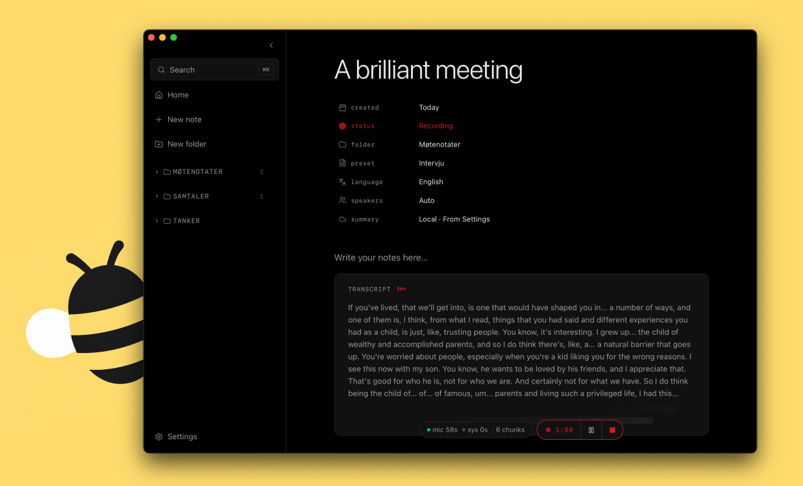

<h1 align="center">Humla</h1>

<p align="center">
  <em>Your meetings, transcribed and summarised on your Mac. Your audio, your keys, your data.</em>
</p>

<p align="center">
  <a href="https://github.com/michaelwilhelmsen/humla/releases/latest">
    
  </a>
</p>

<p align="center">
  <a href="https://github.com/michaelwilhelmsen/humla/releases/latest">Download</a>
  ·
  <a href="#how-it-works">How it works</a>
  ·
  <a href="#features">Features</a>
  ·
  <a href="#building-from-source">Build from source</a>
</p>

<p align="center">
  <a href="https://github.com/michaelwilhelmsen/humla/releases/latest"></a>
  <a href="#license"></a>
  
  
</p>

<h1></h1>

## About

**Humla** is a personal meeting-notes app for macOS, inspired by Granola but built around a simple principle: **your data and keys never leave your machine unless you tell them to**. Everything runs locally — SQLite database, audio capture, transcription, summarisation — with optional cloud APIs you control.

Take freeform notes during a meeting. Humla records mic + system audio in parallel, transcribes with Whisper (on-device or OpenAI), separates speakers with an offline diarizer, and produces a structured Markdown summary that fuses your notes with what was actually said.

The name is Norwegian for *bumblebee* — small, hum, personal.

> [!NOTE]
> Humla is a personal project, not a SaaS. There's no signup, no telemetry, no shared backend. The trade-off: you bring your own model keys (or run locally), and you maintain it yourself.

## Features

- **Hybrid audio capture, parallel streams.** Mic input via `AVAudioEngine` and macOS system audio via `ScreenCaptureKit`, kept as **two independent streams** end-to-end. No mixdown — Whisper sees one clean voice per chunk regardless of overlap, and the diarizer can use channel attribution instead of guessing from a blended embedding.
- **Two transcription providers, your choice per note.** OpenAI cloud (`whisper-1`, `gpt-4o-transcribe`, `gpt-4o-mini-transcribe`, `gpt-4o-transcribe-diarize`) or **on-device Whisper large-v3-turbo Q5_0** running on Apple Silicon via `whisper.cpp` + Metal.
- **Offline speaker diarization.** Post-stop pass on the full recording using FluidAudio's `OfflineDiarizerManager` (pyannote community-1 + VBx clustering with PLDA, on the Apple Neural Engine). In-person meetings get multi-speaker labels; remote calls label your side as `You:` and diarize remote participants. Per-note hint pins the expected speaker count when you know it.
- **Two-source summaries.** The model gets your typed notes and the meeting transcript as separate inputs, with a system prompt telling it to favour your notes for intent and the transcript for facts. Per-note presets: Meeting / 1:1 / Lecture / Interview / Brainstorm / Voice memo, or a custom prompt.
- **Bring your own LLM, including local.** Summaries run on OpenAI's chat completions API or any OpenAI-compatible local server (Ollama, LM Studio, llama.cpp) — including thinking models. Per-note override so a sensitive meeting can stay 100% on-device while everything else uses the cloud.
- **VAD-bounded chunks with rolling context.** Chunks rotate at natural speech pauses (1.0–15 s, 500 ms silence trigger). Each chunk's transcribe call gets the last ~150 committed words and your custom vocabulary as Whisper's `initial_prompt` — proper-noun spelling stays consistent and silence-driven hallucinations almost vanish.
- **Auto-polish on stop.** Conservative LLM cleanup pass that fixes typos and chunk-boundary cuts while preserving line structure, filler words, and speaker labels exactly. Skipped automatically when the configured summary provider is local (polish takes minutes on a 9B local model).
- **Editable transcript with click-to-rename speakers.** Speaker labels render as coloured pills inline; click any pill to rename `Speaker 1` → `Wilma` across the whole transcript. Edits are line-anchored regex rewrites, no metadata table.
- **Auto-update.** Signed, notarised, Ed25519-stapled updater. Existing installs poll the GitHub releases endpoint on launch.
- **System-aware light/dark theme.** Nothing-design aesthetic — Space Grotesk + Space Mono, monochrome palette, instrument-panel labels. Obsidian-style properties panel for per-note metadata.

## How it works

```
┌─────────────────────────────────────────────────────────────┐
│ React + Vite frontend                                       │
│  Tiptap editor · Zustand store · Tailwind v4                │
└──────────────────────┬──────────────────────────────────────┘
                       │ Tauri IPC
┌──────────────────────▼──────────────────────────────────────┐
│ Rust backend                                                │
│                                                             │
│  ┌─────────────┐  ┌─────────────────┐  ┌─────────────────┐  │
│  │SQLite       │  │ audio-capture   │  │ speaker-diarize │  │
│  │ notes /     │  │ sidecar (Swift) │  │ sidecar (Swift) │  │
│  │ folders /   │  │ AVAudioEngine + │  │ FluidAudio      │  │
│  │ settings    │  │ ScreenCaptureKit│  │ (CoreML / ANE)  │  │
│  └─────────────┘  └─────────────────┘  └─────────────────┘  │
│                                                             │
│  ┌─────────────────────────────────┐  ┌─────────────────┐   │
│  │ HTTPS clients                   │  │ Local Whisper   │   │
│  │ OpenAI / OpenAI-compat / HF     │  │ whisper-rs/Metal│   │
│  └─────────────────────────────────┘  └─────────────────┘   │
└─────────────────────────────────────────────────────────────┘
```

During a recording, the audio-capture sidecar produces two parallel streams: per-source VAD-bounded WAV chunks and per-source full WAVs. Each chunk is transcribed independently (per-source `initial_prompt` context, so the user's side and the remote side don't pollute each other's vocabulary). When you stop, an offline diarization pass runs over the per-source full WAVs, the chunk log is aligned to segment timestamps, and the transcript is rewritten with proper speaker labels. A polish pass cleans up typos and punctuation, then summarisation is one click away.

For a deep dive into the architecture, see [`CLAUDE.md`](CLAUDE.md).

## Installation

Download the latest signed and notarised DMG from the [Releases page](https://github.com/michaelwilhelmsen/humla/releases/latest), drag Humla into Applications, and open it. macOS Gatekeeper accepts the build directly because it's notarised.

After installing:

1. Add your **OpenAI API key** in Settings → API key (or skip if you want to run fully on-device).
2. Optionally point Humla at a **local OpenAI-compatible server** (Ollama / LM Studio / llama.cpp) in Settings → Local LLM.
3. **Download the local Whisper model** (~547 MB) and the **diarizer models** (~30 MB) on first use if you want offline transcription / speaker labels.
4. Grant **Microphone** and **Screen Recording** permission on first record. You'll need to relaunch after granting Screen Recording.

Humla auto-updates: existing installs detect new releases on launch and prompt to install.

## Privacy

- **No backend, no telemetry.** Humla doesn't phone home. The only outbound traffic is to the API endpoints you've explicitly configured (OpenAI, your local LLM server, HuggingFace for one-time model downloads).
- **Your data lives in `~/Library/Application Support/no.humla.app/`** — a single SQLite database. Audio chunks are written to a per-recording temp dir and deleted 30 s after stop.
- **Model files** live next to the database: `models/ggml-large-v3-turbo-q5_0.bin` for local Whisper, and FluidAudio's diarizer models in `~/Library/Application Support/FluidAudio/Models/`.
- **API keys** are stored in the same SQLite database. They never leave your machine except to reach the provider you configured.

## Building from source

Requires macOS 13+, Apple Silicon recommended.

Prerequisites:
- Rust toolchain (`curl --proto '=https' --tlsv1.2 -sSf https://sh.rustup.rs | sh`)
- Node 20+ and `pnpm`
- Xcode command line tools (`xcode-select --install`)
- `cmake` (for `whisper.cpp`)

```bash
git clone https://github.com/michaelwilhelmsen/humla.git
cd humla
pnpm install
./scripts/build-sidecar.sh    # builds the audio-capture Swift sidecar
./scripts/build-diarize.sh    # builds the speaker-diarize Swift sidecar
pnpm tauri dev
```

To build a launchable `.app` bundle locally:

```bash
pnpm tauri build --debug
open src-tauri/target/debug/bundle/macos/Humla.app
```

For the full release pipeline (signed + notarised DMG + auto-updater payload + GitHub release), see the script in `package.json` and the credentials it reads from `.env.notarise`. This requires an Apple Developer ID and notary key.

## Project layout

```
humla/
├── src/                        # React frontend
├── src-tauri/                  # Rust backend (Tauri 2)
│   ├── src/
│   │   ├── commands.rs         # Tauri commands, recording lifecycle
│   │   ├── recording.rs        # session state, per-source trails
│   │   ├── diarize.rs          # speaker-diarize sidecar wrapper
│   │   ├── local_whisper.rs    # whisper-rs + Metal
│   │   └── openai.rs           # cloud + local OpenAI-compatible HTTP
│   └── binaries/               # signed sidecar binaries
├── audio-capture/              # Swift sidecar: mic + screen audio
└── speaker-diarize/            # Swift sidecar: offline diarization
```

## Tech stack

- **Frontend** — React 19 + Vite 6 + Tailwind v4 + Tiptap + Zustand + react-markdown + lucide-react
- **App shell** — Tauri 2, Rust (1.85), reqwest with `rustls-tls`, rusqlite (bundled), tokio
- **Local Whisper** — `whisper-rs` (binds `whisper.cpp`) with the `metal` feature, large-v3-turbo Q5_0
- **Speaker diarization** — FluidAudio Swift package, pyannote community-1 + VBx clustering with PLDA, CoreML on Apple Neural Engine
- **Audio capture** — Swift, `AVAudioEngine`, `ScreenCaptureKit`, sandbox-detached via `setsid` so TCC permissions bind to the sidecar binary

## Acknowledgements

Humla stands on the shoulders of:

- [whisper.cpp](https://github.com/ggml-org/whisper.cpp) by Georgi Gerganov — the local transcription engine
- [FluidAudio](https://github.com/FluidInference/FluidAudio) — the offline diarization pipeline (pyannote community-1 + VBx + PLDA, ported to CoreML)
- [Tauri](https://tauri.app) — the native app shell
- [Tiptap](https://tiptap.dev) — the rich-text editor
- [Granola](https://granola.ai) — the user-experience inspiration

## License

MIT.
