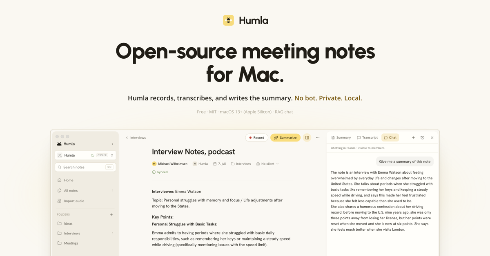

<h1 align="center">Humla</h1>

<p align="center">
  <a href="https://github.com/michaelwilhelmsen/humla/releases/latest">
    
  </a>
</p>

<p align="center">
  <a href="https://humla.team"><strong>humla.team</strong></a>
  ·
  <a href="https://github.com/michaelwilhelmsen/humla/releases/latest"><strong>Download for macOS</strong></a>
  ·
  <a href="#what-it-does">What it does</a>
  ·
  <a href="#privacy">Privacy</a>
  ·
  <a href="#how-it-works">How it works</a>
  ·
  <a href="#build-from-source">Build</a>
</p>

<p align="center">
  <a href="https://humla.team"></a>
  <a href="https://github.com/michaelwilhelmsen/humla/releases/latest"></a>
  <a href="#license"></a>
  
  
</p>

<h1></h1>

## About

**Humla** is a meeting-notes app for macOS, inspired by Granola. You take freeform notes during your meeting; Humla records the audio, transcribes it, separates speakers, and produces a structured summary that combines your notes with what was actually said.

Built around one principle: **your audio and your data stay on your machine** unless you explicitly send them somewhere you choose — a transcription/LLM provider, or an optional sync server. Everything works locally — recording, transcription, speaker identification, even summarisation if you point it at a local LLM.

The name is Norwegian for *bumblebee* — small, hum, personal.

> [!NOTE]
> Humla is an indie project, not a big SaaS. The app is **local-first and free** — no account, no telemetry, bring your own API keys (or run fully local). If you want to sync across devices or share workspaces with a team, **Humla Cloud** is an optional paid add-on — and you can self-host the sync server instead. Either way, transcription and summaries still run through your own providers or on-device. See [Team sync & self-hosting](#team-sync--self-hosting).

## What it does

### Records your meetings, two streams at once

Humla captures your microphone and your computer's audio (Zoom, Meet, Slack huddles, anything) at the same time, kept as two separate streams. That means in a remote call your voice doesn't get mixed with the other person's, so the transcript stays clean and "you said vs. they said" is unambiguous. In an in-person meeting it records your room mic and tags the different voices it hears.

### Transcribes accurately — including in your language

Pick the transcription engine that fits, and you can mix-and-match **per language**:

- **Local Whisper** — runs entirely on your Mac via Apple Silicon's GPU. Free after a one-time download. Multiple multilingual models plus a **Norwegian-tuned model** (NB Whisper Large from Nasjonalbiblioteket).
- **OpenAI** — `whisper-1`, `gpt-4o-transcribe`, `gpt-4o-mini-transcribe`, `gpt-4o-transcribe-diarize`.
- **Deepgram** — Nova-3 / Nova-2, native diarization, very strong on conversational English.
- **Groq** — `whisper-large-v3-turbo` at OpenAI-compatible endpoints — same Whisper quality, ~10× cheaper and faster than OpenAI's hosted Whisper.

Set a **default provider** in Settings, then add **per-language overrides** if you want — e.g. *Norwegian → Local NB Whisper, English → Deepgram, fallback → OpenAI*. Humla picks the right one automatically based on the recording's language.

### Identifies speakers, automatically and offline

When you stop the recording, Humla runs a speaker-identification pass on your Mac (no audio uploaded). It labels each turn with `Speaker 1`, `Speaker 2`, etc. — click any label to rename them ("Speaker 2" → "Wilma") and the change applies across the whole transcript.

Two engines, both free and on-device:
- **Community-1** — robust default, auto-detects how many speakers are in the room.
- **Sortformer** — better at rapid back-and-forth, fixed 4-speaker cap.

### Summarises with both your notes and the transcript

When you click *Summarize*, the model gets your typed notes **and** the transcript as two separate labelled inputs — `[Notater]` and `[Transkripsjon]`, tagged *user-written* and *auto* so it knows which is which. Pick a preset — Meeting / 1:1 / Lecture / Interview / Brainstorm / Voice memo — or write your own.

The summary can run on:
- **OpenAI** — gpt-5.x reasoning models, gpt-4o, and others.
- **Any OpenAI-compatible local server** — Ollama, LM Studio, llama.cpp, vLLM. Sensitive meetings can stay 100% on-device.

### Ask your notes — and see where the answer came from

Every note has a **Chat** tab that answers questions about your meetings. It isn't a canned prompt over one transcript: the assistant runs a real retrieval loop, **searching and reading your notes** to ground its answer, then **cites the notes it used** as chips you can click straight through to.

- **Hybrid retrieval** — full-text keyword search *and* semantic (embedding) search over your notes, so it finds things you didn't phrase exactly right.
- **Choose how wide it looks** — this note, this folder, or all your notes, per conversation.
- **See its work** — it shows what it searched and read, so an answer is auditable rather than a black box.
- **Local or cloud** — point it at Ollama for fully on-device chat, or OpenAI. Configured under Settings → Chat, separately from your transcription and summary providers.

### Use your notes from Claude Code, Codex, or any MCP client

Humla ships its own **[Model Context Protocol](https://modelcontextprotocol.io) server**, so the agent you already work in can search and read your meeting notes without you switching apps. Ask Claude Code *"what did we agree with Acme about the renewal?"* and it looks it up in your actual meetings.

Six read-only tools: `search_notes`, `get_note`, `get_transcript`, `list_notes`, `list_folders`, `list_clients`. Search spans your typed notes, the summary **and** the spoken transcript, and each result says which of the three it came from — so "what did they actually say" is a question you can ask. Results can be narrowed by folder, client, who spoke, language, and a date window (relative — *the last 30 days* — or absolute, *2026-06-01 to 2026-06-30*).

- **Off until you turn it on.** Settings → General → Integrations, which then hands you a ready-to-paste config line for Claude Code and for Codex. Installing an update never quietly opens your meetings to anything.
- **Read-only, and no audio.** Nothing an agent does can change or delete a note, and no tool returns or references a recording — the same absolute rule the rest of the app follows.
- **No key, no network, no server.** It's a small local binary that reads your SQLite database directly, so search is keyword-based rather than embedding-based: nothing to pay for, nothing to send anywhere, and no Keychain prompt. There's no port and no token — the file permissions on your own machine are the authorization.
- **Works whether or not Humla is open**, and always reads the workspace you're currently in. The workspace is resolved on Humla's side, never passed in, so a client can't ask its way from Personal notes into a shared workspace or back.

### Stays out of your way

- **Custom vocabulary** — names, jargon, acronyms biased into the transcription so they spell consistently.
- **Per-note language** — each note can override the global language for one-off bilingual calls.
- **Folders + search** — flat folder list with full-text search across titles, bodies, transcripts, and folder names.
- **Click-to-edit transcript** — coloured speaker pills inline; click anywhere to fix a transcription error.
- **Auto-update** — signed and notarised; existing installs detect new releases on launch.
- **System-aware light/dark theme** — clean, typographic UI in Hanken Grotesk with a warm gold accent.

## Privacy

The defaults are designed so nothing leaves your machine unless you tell it to.

- **No telemetry, no backend by default.** Humla doesn't phone home. The only outbound traffic is to the API endpoints you've explicitly configured — plus, *if* you opt into sync, the server you connect to (Humla Cloud or your own).
- **Your notes and transcripts** live in a single SQLite database at `~/Library/Application Support/no.humla.app/`.
- **Recorded audio:**
  - During the recording, audio is held in a per-recording temp directory.
  - After you stop, Humla saves a mixed `playback.wav` per note to `~/Library/Application Support/no.humla.app/recordings/<note_id>/` so you can play the meeting back with word-by-word transcript highlight. The temp directory is then deleted.
  - The raw per-source streams (separate mic + system WAVs) are *not* kept by default. Turn on Settings → Recording → Audio retention to keep those too — useful for re-running diarization at different thresholds.
- **The MCP server is off until you enable it**, and read-only when you do. It's a local binary reading the same SQLite database — no port, no network, and no tool that can reach a recording. Turning it off in Settings takes effect on the next tool call, not at the client's next restart.
- **API keys** are stored in the macOS **Keychain** (one entry per provider — OpenAI, Deepgram, Groq), not in plaintext on disk.
- **Model downloads** are one-time fetches from HuggingFace; the files live in `~/Library/Application Support/no.humla.app/models/` and `~/Library/Application Support/FluidAudio/Models/`.

If you use only Local Whisper + Community-1 (or Sortformer) + a local LLM for summaries, **no audio or text ever leaves your Mac**.

## Team sync & self-hosting

Humla is local-first and works fully offline — your local/Personal notes never need a server. If you want to **sync across your devices** or **share workspaces with teammates**, point the app at a sync server (Settings → Account → Connect). The server only stores and relays your notes — transcription and summaries still run through your own providers or on-device, and it never sees your API keys.

The sync engine speaks to a **[PocketBase](https://pocketbase.io)** backend (a single Go binary: SQLite + auth + file storage + REST API). Two ways to get one:

### Option 1 — Humla Cloud (managed)

The hosted option: sign up in-app, nothing to set up. Team workspaces are a paid subscription — **$5 per user / month**, via Stripe — with a **14-day free trial**; your local/Personal notes are always free. That's about a third of what Granola or Otter charge per seat. The convenient path — you run no infrastructure.

### Option 2 — Self-host (free)

Run your own PocketBase server — on a VPS or on your own machine — and point Humla at it in **Settings → Account → Connect**. Self-hosted servers have **no paywall**: every team feature is free. Billing only activates when the server has `STRIPE_SECRET_KEY` set, so a self-hosted server never asks anyone to pay.

Humla Cloud is developed together with the app rather than bolted on afterwards, and that's deliberate: it's what makes every local feature behave the same way inside a shared workspace as it does on your own machine. The sync engine itself lives in this repo — [`src-tauri/crates/cloud-sync`](src-tauri/crates/cloud-sync) is the client side, open source like the rest of the app. What isn't distributed is the server half that Humla Cloud runs against it, because the two move in lockstep and I change them together.

So the honest advice for self-hosting is to **fork this repo and build your cloud layer against that snapshot**. A fork pins a version of the client you control, so your server can't drift out from under it when the app moves on — and you maintain the pair. `cloud-sync` tells you exactly what the server has to answer: the collections it pushes and pulls, the fields on each record, soft deletes, and last-write-wins on `client_updated_at`.

The stack Humla Cloud uses, if you want somewhere to start:

- **[PocketBase](https://pocketbase.io)** — one Go binary: SQLite, auth, file storage, REST API, admin UI. The whole server is a `pb_data` directory, which is also your backup story.
- **Caddy** — reverse proxy for automatic TLS. Skippable on a trusted LAN; plain `http://` works, so a NAS needs no domain or certificate.
- **Object storage (S3 / Cloudflare R2)** — audio blobs, configured in PocketBase's Settings → Files, so recordings don't fill the local disk.
- **[Litestream](https://litestream.io)** — continuous SQLite replication to the same bucket.
- **SMTP** — transactional email for signup verification and invites. Without it, sync works fine but accounts stay unverified.
- **A small [Hono](https://hono.dev) service on Node** for workspace chat, using the [Vercel AI SDK](https://sdk.vercel.ai) for the agentic SSE loop and its own SQLite vector index (`better-sqlite3` + [`sqlite-vec`](https://github.com/asg017/sqlite-vec)). Chat retrieval runs server-side, which doesn't fit inside PocketBase's JS hooks — hence the separate process.

## Quick start

1. **Download** the latest signed + notarised DMG from the [Releases page](https://github.com/michaelwilhelmsen/humla/releases/latest).
2. **Drag Humla** into Applications and open it. macOS Gatekeeper accepts the build directly because it's notarised.
3. **Grant permissions** on first record: Microphone, and (for capturing system audio) Screen Recording. You'll need to relaunch after granting Screen Recording.
4. **Pick your providers** in Settings → Transcription:
   - Local Whisper alone is great if you don't want any cloud calls — click *Download* on a model (~500 MB–1.1 GB depending on which one).
   - OR add an API key for OpenAI / Deepgram / Groq — keys live inline under the provider you pick, and go straight to the macOS Keychain.
5. *Optional*: download a speaker-diarization model under Settings → Transcription → Speaker diarization (~30 MB).
6. *Optional*: point Humla at a local LLM server (Ollama / LM Studio / llama.cpp) under Settings → Summary for fully on-device summaries, and under Settings → Chat for fully on-device chat.

That's it. Click *Record* to start, *Stop* when you're done, *Summarize* when you want notes.

Humla auto-updates: existing installs detect new releases on launch and prompt to install.

## How it works

```
┌─────────────────────────────────────────────────────────────┐
│ React + Vite frontend                                       │
│  Tiptap editor · Zustand store · Tailwind v4                │
└──────────────────────┬──────────────────────────────────────┘
                       │ Tauri IPC
┌──────────────────────▼──────────────────────────────────────┐
│ Rust backend                                                │
│                                                             │
│  ┌─────────────┐  ┌─────────────────┐  ┌─────────────────┐  │
│  │SQLite       │  │ audio-capture   │  │ speaker-diarize │  │
│  │ notes /     │  │ sidecar (Swift) │  │ sidecar (Swift) │  │
│  │ folders /   │  │ AVAudioEngine + │  │ FluidAudio      │  │
│  │ settings    │  │ ScreenCaptureKit│  │ (CoreML / ANE)  │  │
│  └─────────────┘  └─────────────────┘  └─────────────────┘  │
│                                                             │
│  ┌─────────────────────────────────┐  ┌─────────────────┐   │
│  │ HTTPS clients                   │  │ Local Whisper   │   │
│  │ OpenAI / Deepgram / Groq / HF   │  │ whisper-rs/Metal│   │
│  └─────────────────────────────────┘  └─────────────────┘   │
└─────────────────────────────────────────────────────────────┘
```

In plain language: when you hit Record, a small native Swift helper captures your microphone and your system audio as two separate streams, splits each one into short clips at natural speech pauses, and feeds the clips to whichever transcription engine you picked. Your typed notes are saved continuously alongside the transcript. When you stop, Humla runs speaker identification offline (still no audio leaves your Mac) and labels the transcript. *Summarize* sends your notes + the transcript to your chosen LLM and produces a structured Markdown summary. Notes are also indexed for search — full-text plus embeddings — which is what the Chat tab draws on when it goes looking for an answer. The MCP server reads that same database — the keyword half of the index, so it needs no API key — which is why an outside agent searches the notes you already have rather than a copy of them.

For a deep dive into the architecture — module map, data flow, gotchas — see [`CLAUDE.md`](CLAUDE.md).

## Build from source

Requires macOS 13+, Apple Silicon recommended.

Prerequisites:
- Rust toolchain (`curl --proto '=https' --tlsv1.2 -sSf https://sh.rustup.rs | sh`)
- Node 20+ and `pnpm`
- Xcode command line tools (`xcode-select --install`)
- `cmake` (for `whisper.cpp`)

```bash
git clone https://github.com/michaelwilhelmsen/humla.git
cd humla
pnpm install
./scripts/build-sidecar.sh    # builds the audio-capture Swift sidecar
./scripts/build-diarize.sh    # builds the speaker-diarize Swift sidecar
./scripts/build-mcp.sh        # builds the humla-mcp server binary
pnpm tauri dev
```

All three are bundled binaries the app declares up front, so the build fails if any is missing — run them once after cloning, and again only when you change their source.

To build a launchable `.app` bundle locally:

```bash
pnpm tauri build --debug
open src-tauri/target/debug/bundle/macos/Humla.app
```

For the full release pipeline (signed + notarised DMG + auto-updater payload + GitHub release), see `scripts/release.sh` and the credentials it reads from `.env.notarise`. Requires an Apple Developer ID, notary key, and a Tauri updater Ed25519 keypair.

## Project layout

```
humla/
├── src/                        # React frontend (Tiptap + Zustand)
├── src-tauri/                  # Rust backend (Tauri 2)
│   ├── src/
│   │   ├── commands.rs         # recording lifecycle, chunk transcription, diarize-on-stop
│   │   ├── commands/           # command groups: notes, folders, settings, chat, clients,
│   │   │                       #   cloud, export, models, summary, api_keys, …
│   │   ├── recording.rs        # session state, per-source trails
│   │   ├── stt/                # STT adapter abstraction (OpenAI/Local/Deepgram/Groq)
│   │   ├── chat/               # agentic note-chat: tool loop, retrieval, providers
│   │   ├── mcp/                # the MCP server's six read-only tools over your notes
│   │   ├── bin/humla-mcp.rs    # that server as a second binary, shipped in the bundle
│   │   ├── diarize.rs          # speaker-diarize sidecar wrapper
│   │   ├── local_whisper.rs    # whisper-rs + Metal model registry
│   │   └── openai.rs           # OpenAI HTTP client + summary endpoint
│   └── binaries/               # signed sidecar binaries
├── audio-capture/              # Swift sidecar: mic + screen audio
└── speaker-diarize/            # Swift sidecar: offline diarization
```

## Tech stack

- **Frontend** — React 19 + Vite 6 + Tailwind v4 + Tiptap + Zustand + react-markdown + lucide-react
- **App shell** — Tauri 2, Rust 1.85, reqwest (rustls-tls), rusqlite (bundled), tokio
- **Local Whisper** — `whisper-rs` 0.16 (binds `whisper.cpp`) with the `metal` feature; `large-v3-turbo-q5` default plus alternative multilingual models and NB Whisper Large for Norwegian
- **Speaker diarization** — FluidAudio Swift package; pyannote community-1 + VBx clustering with PLDA, *or* NVIDIA Sortformer; CoreML on Apple Neural Engine
- **Note chat** — agentic tool loop over three retrieval tools; hybrid search combining SQLite **FTS5** keyword ranking with semantic embedding similarity; OpenAI or Ollama as the chat provider
- **MCP server** — `rmcp` (the official Rust MCP SDK) over stdio, built as a second binary from the same crate and signed into the app bundle; opens the notes database directly, so it runs with or without the app
- **Audio capture** — Swift, `AVAudioEngine`, `ScreenCaptureKit`; sandbox-detached via `setsid` so TCC permissions bind to the sidecar binary

## Acknowledgements

Humla stands on the shoulders of:

- [whisper.cpp](https://github.com/ggml-org/whisper.cpp) by Georgi Gerganov — the local transcription engine
- [FluidAudio](https://github.com/FluidInference/FluidAudio) — the offline diarization pipeline (pyannote community-1 + VBx + PLDA, plus Sortformer, ported to CoreML)
- [NB Whisper Large](https://huggingface.co/NbAiLab/nb-whisper-large) by Nasjonalbiblioteket — Norwegian-tuned Whisper model
- [Tauri](https://tauri.app) — the native app shell
- [Tiptap](https://tiptap.dev) — the rich-text editor
- [Granola](https://granola.ai) — the user-experience inspiration

## License

MIT.
